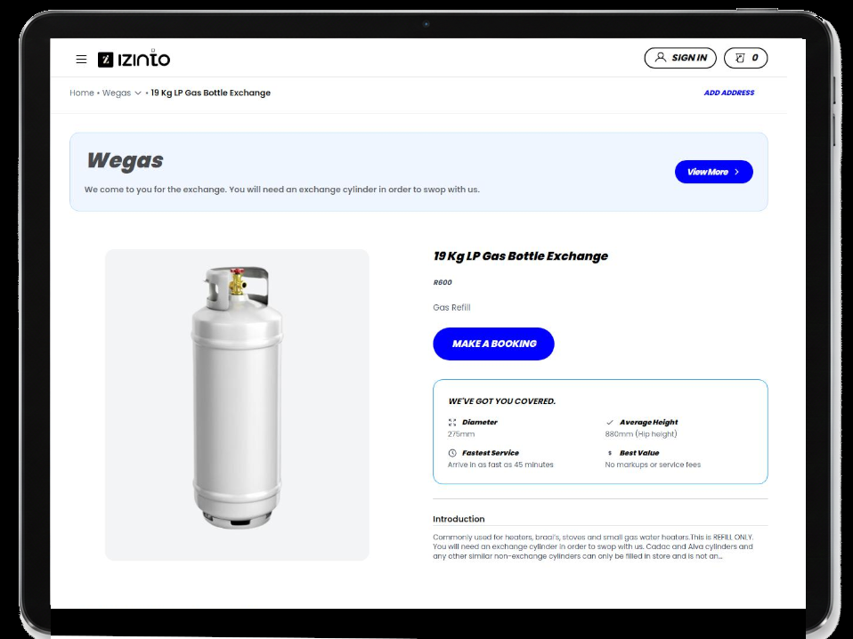

# Izinto - Everything On-demand

[](https://vercel.com/new/clone?repository-url=https%3A%2F%2Fgithub.com%2FDinokojt7%2Fizinto-landing-page.git)
[](https://nextjs.org/blog/next-16)
[](https://github.com/vercel/next.js/releases/tag/v16.0.10)
[](https://262.ecma-international.org/14.0/)
[](https://tailwindcss.com/)
[](https://www.npmjs.com/)
[](https://opensource.org/licenses/MIT)
[](https://reactjs.org/)
[](https://firebase.google.com/)
[](https://zustand-demo.pmnd.rs/)
[](https://www.framer.com/motion/)

A modern service booking and e-commerce platform that connects users with local home service professionals. Features a streamlined booking flow and an integrated payment system.

## :fire: Core Features <a id="core-features"></a>

### Service Categories

- 🧺 Laundry & Dry Cleaning
- ⛽ Gas Refill & Exchange
- 🐾 Pet Care & Grooming
- 🧹 Home Cleaning
- 👟 Sneaker & Blanket Cleaning

### Functional Capabilities

- Real-time service booking
- Live order tracking(to-be-implemented)
- Secure in-app payments(to-be-implemented)
- Multi-service cart management

## 🛠️ Tech Stack

- **Framework**: [Next.js 16](https://nextjs.org/) (App Router)
- **Language**: JavaScript (ES2023+)
- **Styling**: [Tailwind CSS](https://tailwindcss.com/)
- **State Management**: [Zustand](https://zustand-demo.pmnd.rs/)
- **Animations**: [Framer Motion](https://www.framer.com/motion/)
- **Backend & Auth**: [Firebase](https://firebase.google.com/) (Auth, Firestore)
- **Package Manager**: [npm](https://www.npmjs.com/)
- **Deployment**: [Vercel](https://vercel.com/)
- **Maps**: [Google Maps API](https://developers.google.com/maps)
- **HTTP Client**: [Axios](https://axios-http.com/)

## 🚀 Getting Started

### Prerequisites

- **Node.js 18+** (LTS version recommended)
- **npm 10+** (comes with Node.js)
- **A Firebase project** (for authentication and database)
- **A Google Cloud project** (for Google Maps API)

### Installation

1. **Clone the repository**

   ```bash
   git clone https://github.com/Dinokojt7/izinto-landing-page.git
   cd izinto-landing-page
   ```

2. **Install dependencies**

   ```bash
   npm install
   ```

3. **Setup environment variable**

   ```bash
   cp .env.example .env.local
   ```

   Open the newly created .env.local file in your editor and fill in all the required values from your service dashboards (Firebase, Google Cloud, etc.).

   ```bash
   # Firebase Configuration (from your Firebase project settings)

   NEXT_PUBLIC_FIREBASE_API_KEY=your_api_key_here
   NEXT_PUBLIC_FIREBASE_AUTH_DOMAIN=your_project_id.firebaseapp.com
   NEXT_PUBLIC_FIREBASE_PROJECT_ID=your_project_id
   NEXT_PUBLIC_FIREBASE_STORAGE_BUCKET=your_project_id.appspot.com
   NEXT_PUBLIC_FIREBASE_MESSAGING_SENDER_ID=your_sender_id
   NEXT_PUBLIC_FIREBASE_APP_ID=your_app_id
   NEXT_PUBLIC_FIREBASE_MEASUREMENT_ID=your_measurement_id

   # Netlify Functions API URL
   NEXT_PUBLIC_API_URL=https://gregarious-marshmallow-0b7661.netlify.app/.netlify/functions/api
   # For local development, you might use:
   # NEXT_PUBLIC_API_URL=http://localhost:9999/.netlify/functions/api

   # Email Service (SMTP) Configuration
   SMTP_HOST=smtp.gmail.com
   SMTP_PORT=587
   SMTP_USER=your_email@gmail.com
   SMTP_PASS=your_app_specific_password

   # Google Maps API
   NEXT_PUBLIC_GOOGLE_MAPS_API_KEY=your_google_maps_api_key_here
   ```

4. **Start the development server**

   ```bash
   npm run dev
   ```

5. **Open your browser and navigate to http://localhost:3000**

### Available Scripts

```bash
npm run dev       # Start the Next.js development server
npm run build     # Build the application for production
npm start         # Start the production server (after build)
npm run lint      # Run ESLint for code quality checks
```

## 📁 Project Structure

```
├── src/
│ ├── app/ # Next.js 14 App Router
│ │ ├── (auth)/
│ │ │ ├── login/
│ │ │ ├── register/
│ │ │ └── layout.jsx
│ │ ├── (main)/
│ │ │ ├── page.jsx # Landing page
│ │ │ ├── cart/
│ │ │ ├── services/
│ │ │ ├── checkout/
│ │ │ └── layout.jsx
│ │ ├── api/ # API routes
│ │ │ ├── auth/
│ │ │ ├── services/
│ │ │ └── cart/
│ │ ├── globals.css
│ │ ├── layout.jsx
│ │ └── page.jsx
│ ├── components/
│ │ ├── ui/ # Reusable UI components
│ │ │ ├── Button.jsx
│ │ │ ├── Input.jsx
│ │ │ ├── Card.jsx
│ │ │ ├── Dialog.jsx
│ │ │ └── Select.jsx
│ │ ├── layout/ # Layout components
│ │ │ ├── Header.jsx
│ │ │ ├── Footer.jsx
│ │ │ ├── Navigation.jsx
│ │ │ └── CartSidebar.jsx
│ │ ├── services/ # Service-specific components
│ │ │ ├── ServiceGrid.jsx
│ │ │ ├── ServiceCard.jsx
│ │ │ ├── HorizontalScroll.jsx
│ │ │ └── SizeSelector.jsx
│ │ ├── maps/ # Map components
│ │ │ ├── LocationMap.jsx
│ │ │ ├── AddressSearch.jsx
│ │ │ └── ServiceArea.jsx
│ │ └── cart/ # Cart components
│ │ ├── CartItem.jsx
│ │ ├── CartSummary.jsx
│ │ └── AddToCart.jsx
│ ├── lib/ # Utilities and configurations
│ │ ├── firebase/ # Firebase configuration
│ │ │ ├── config.js
│ │ │ ├── auth.js
│ │ │ ├── firestore.js
│ │ │ └── storage.js
│ │ ├── utils/ # Utility functions
│ │ │ ├── constants.js
│ │ │ ├── dimensions.js
│ │ │ ├── formatters.js
│ │ │ └── validators.js
│ │ ├── api/ # API client and hooks
│ │ │ ├── client.js
│ │ │ ├── services.js
│ │ │ ├── cart.js
│ │ │ └── hooks.js
│ │ └── stores/ # Zustand stores
│ │ ├── auth-store.js
│ │ ├── cart-store.js
│ │ ├── services-store.js
│ │ └── ui-store.js
│ ├── hooks/ # Custom React hooks
│ │ ├── useAuth.js
│ │ ├── useCart.js
│ │ ├── useServices.js
│ │ ├── useLocalStorage.js
│ │ └── useGeolocation.js
```

## 🎨 Customization

### Styling

The app uses Tailwind CSS for styling. You can customize:

- Colors in `src/lib/utils/constants.js`
- Dimensions in `src/lib/utils/dimensions.js`

### Installations

The app delivers a truly native-like mobile experience with full PWA support, status bar theming, and safe-area handling across iOS and Android devices.

- Complete manifest.json with proper app metadata
- Service worker for offline capabilities and resource caching
- App icon sets for all device
- Add to Home Screen with native launch behavior

- iOS (Safari/WebKit):
  - White status bar with black icon rendering
  - Proper handling of apple-mobile-web-app-\* meta tags

- Android (Chrome):
  - Full-screen navigation bar coverage
  - PWA install prompt and management

## 📄 License

This project is licensed under the MIT License - see the [LICENSE](LICENSE) file for details.

## 🙏 Acknowledgments

- [Firebase](https://firebase.google.com/) for authentication and firestore
- [Netlify](https://www.netlify.com/) for static hosting and severless functions
- [Google_Cloud_Console](https://console.cloud.google.com/) for project management and api services
- [Vercel](https://vercel.com/) for hosting and deployment

---

<p align="center">
  Made with ❤️ by <a href="https://github.com/Dinokojt7">Tiisetso Dinoko</a>
</p>
